**Project Report - Churn Prediction**

*Ujjwal Ravani x Madhav Kamani*

Starting off, we first want to understand and clean the dataset. We read the excel file, and look at the dataframe. It has 5630 customer entries and 20 parameters. There are some typos, some repeated values and other minor errors in the dataset. We clean the dataset, making it ready for analysis. Here are the different columns (parameters) and their unique values :

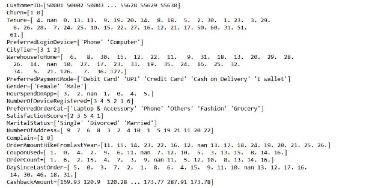

For the EDA part, we first decide the questions we want to ask, which would then be answered by analyzing the data. Here are the questions we decided to ask :

1. Is there a relationship between Gender and Churn?
1. Which MartialStatus has the highest Churn rate?
1. Which CityTier has higher Tenure and OrderCount?
1. Do Customers with High SatisfactionScore have high HourSpendOnApp?

   Is there a correlation between SatisfactionScore and HourSpendOnApp?

5. Which CityTier has the most HourSpendOnApp?
5. What is the relation between NumberOfAddress and CityTier?
5. Do people who complain churn more ?
5. What is the relation between Complain and DaySinceLastOrder?
5. Is there a relationship between PreferredLoginDevice and Churn?
5. What is the distance between warehouse and customer house in different city tier?
5. Do different CityTiers have different preferred products?
5. What is the preferred payment mode for different CityTiers?
5. Which CityTier has the highest OrderCount?
5. Does the percentage increase in order amount from last year affect churn rate?
5. What is ordercount for customers with high HourSpendOnApp?
5. Is there a relationship between preferred order category and churn rate?
5. Do customers who use more coupons have lower churn rates?
18. Is there a connection between satisfaction score and number of orders in the past month?
18. Is there a relation between CashbackAmount and order counts within churn?
18. Are customers who complained more, more likely to churn?

1\. a. Some columns are numerical (integers/float) and some columns are categorical

(strings), to understand the data at a high level we first look at the density plot of these features :

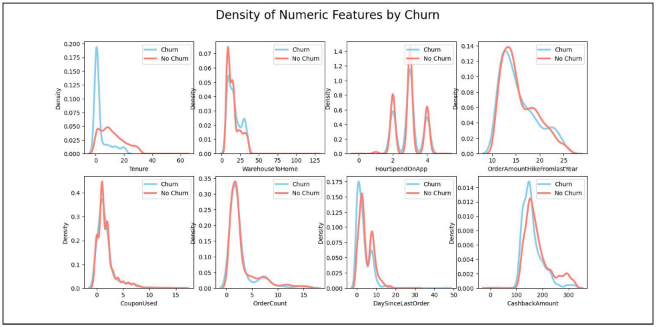

b.

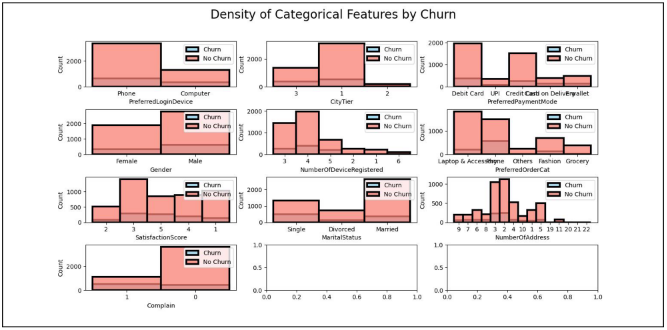

c.

Here’s the correlation matrix of numerical features.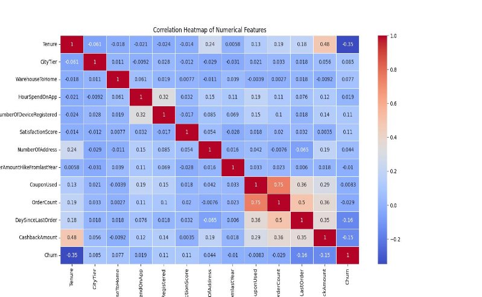

2\.

1. To find out the relationship b/w gender and churn, we find the % churned users who are male vs female

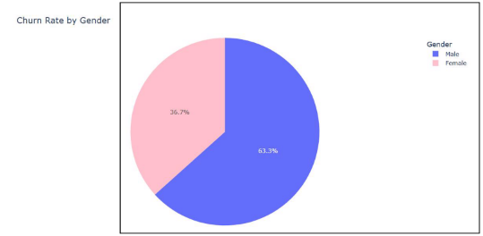

2. Next, we looked at the percentage male users who churned vs % female users who churned

   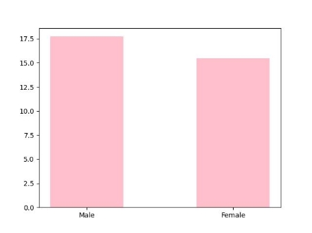

3\.

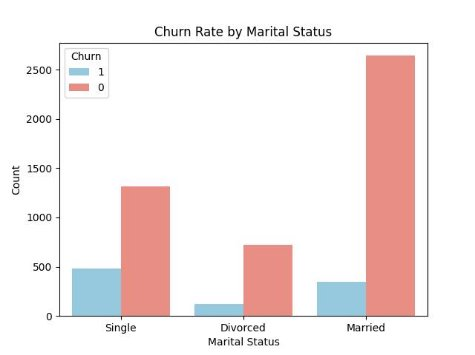

4. Analyzing parameters against City Tier
1. Hours spent on app vs city tier

   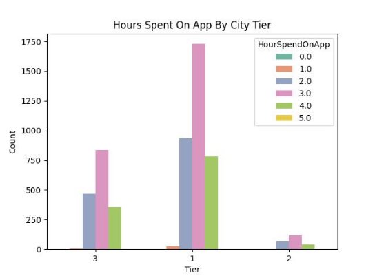

2. Tenure vs city tier

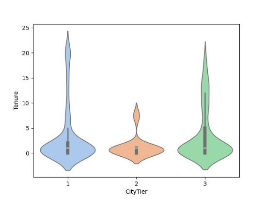

|CityTier|Mean Tenure|
| - | - |
|1|10\.52|
|2|11\.16|
|3|9\.36|

3. Distance of warehouse to home by city tier

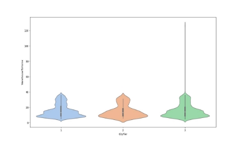

4. Preferred Order Category by City Tier

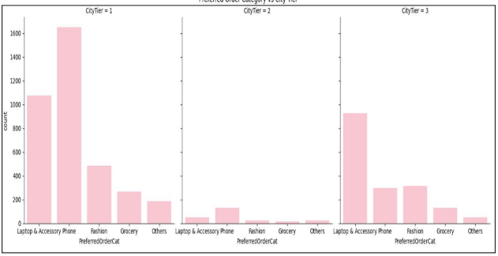

5. Preferred Payment Mode by City Tier

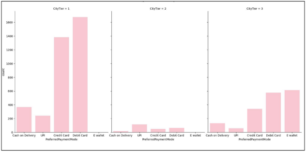

6. Cumulative orders per city tier

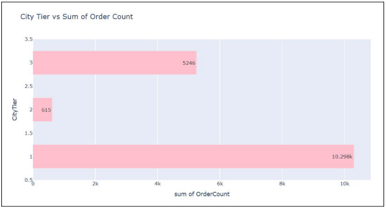

5. Churn Rate vs Preferred order category

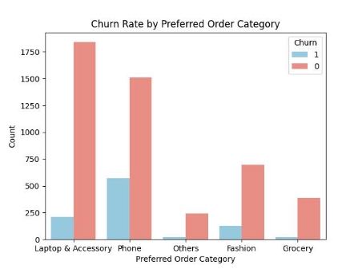

6. Churn Rate by Complain

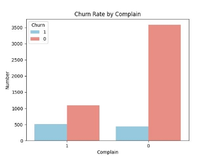

7. Days Since Last order vs Complain

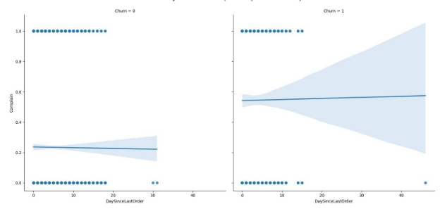

8\.

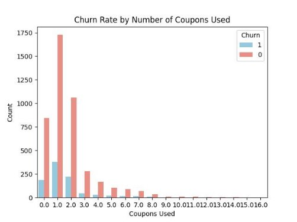

9\.

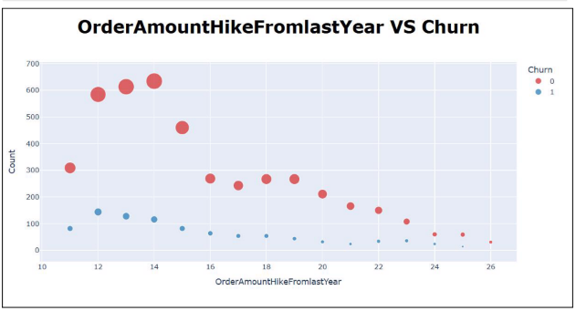

10\.

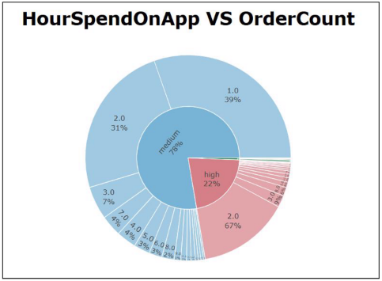

11\.

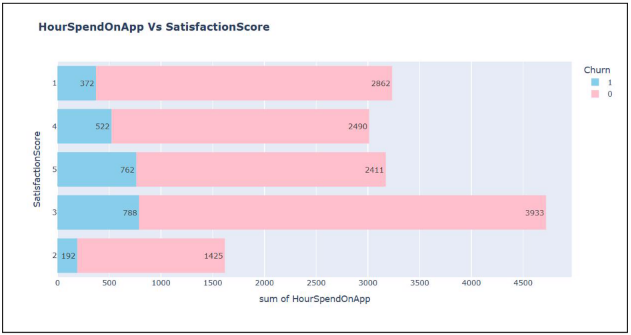

12. Churn % by device type

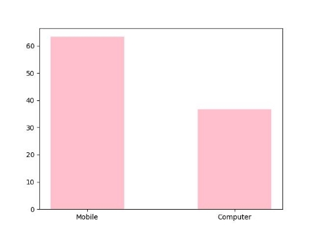

13. Churn % by Satisfaction Score

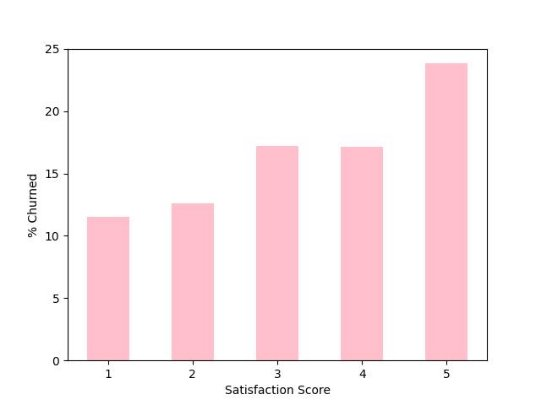

14\.

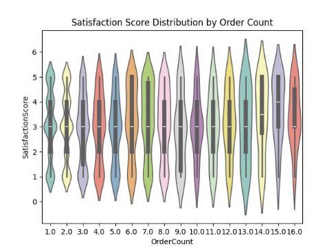

15\.

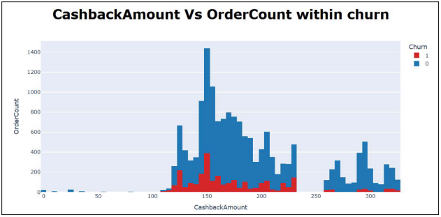

EDA Insights

- The males are more likely to churn as we have 63.3 % churned males from the app. This might be due to a lack of products that typically males are interested in.
- If we look at marital status, most customers are married.

- Single customers are most likely to churn from the app.
- City Tier 2 has the highest average tenure, but tenure does not vary strongly with city tier.
- Sum of hours spent on the app and satisfaction seem to have no particular correlation.
- City tier 1 has spent the most hours on the app.
- There is a weak negative relation between complaining and the number of days since last order
- Mobile phone users are likely to churn may be this indicates a problem on the app user experience on the app mobile version.
- The distance of warehouse is fairly constant across different tiers, meaning the company has established its warehouses even in smaller cities.
- Laptop & accessories and mobile phones are the preferred categories across all city tiers
- Preferred payment method for CityTier '1' ==> DebitCard

  Preferred payment method for CityTier '2' ==> UPI

  Preferred payment method for CityTier '3' ==> E wallet

- CityTier '1' has the highest order count with 10298 orders.
- When the Year over Year Order Hike percentage increases, churn decreases. We should think about increasing this, especially for users who have this % value to be 12-15.
- Among the users who have spent a ‘high’ amount of time on the app ( > 3 Hours )
- Customers who have used more coupons tend to churn lower
- SatisfactionScore isn’t correlated to OrderCount
- There is no apparent relation between cash back amount and order count. Customers having cashback amounts in the range 100-200 tend to churn more.
- As expected, customers who’ve complained, tend to churn more.

After applying the algorithms, we rank the features that contribute the most towards churn. Hence, looking at trends of the highest ranked features will give us the most accurate prediction of churn trends in the future.

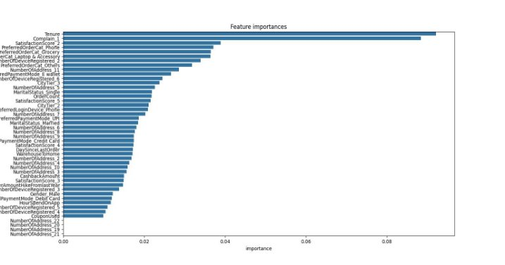
